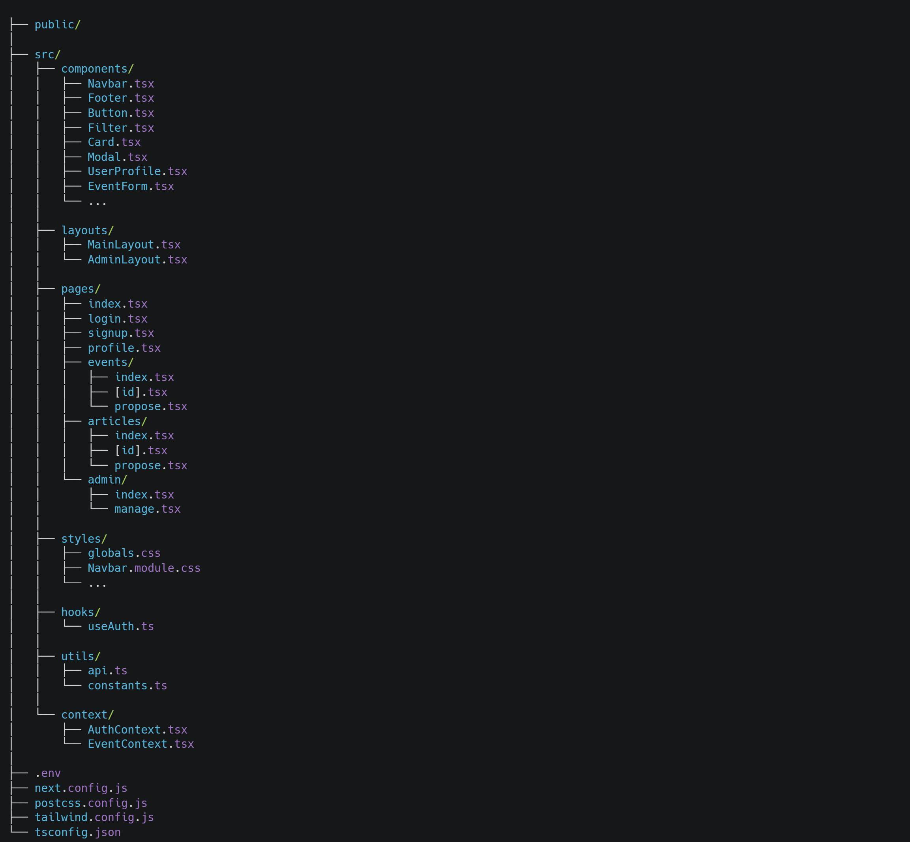

# 🌍 SiciliPulse

## Panoramica del Progetto

SiciliPulse è una piattaforma digitale innovativa che cattura il "battito" culturale della Sicilia, offrendo un'esperienza utente personalizzata e coinvolgente. Grazie all'integrazione di funzionalità avanzate e tecnologie moderne, SiciliPulse mira a diventare il punto di riferimento per contenuti interattivi, informazioni locali e coinvolgimento della community.

## Caratteristiche Principali di SiciliPulse

### Iscrizione e Fidelizzazione Utente
- Creazione di profili utente per accedere a funzionalità esclusive.
- Possibilità di salvare contenuti preferiti, votare articoli e recensire eventi.
- Percorsi personalizzati per salvare e riprendere contenuti facilmente.

### Percorsi Salvabili e Personalizzati
- Creazione di “playlist” di lettura su misura, basate sui gusti e preferenze dell'utente.

### Votazioni, Recensioni e Preferiti
- Funzioni di votazione e recensione per arricchire l’esperienza utente e incentivare la partecipazione attiva della community.

### Intelligenza Artificiale per Personalizzazione e Accessibilità
- Suggerimenti di contenuti personalizzati e miglioramento dell'accessibilità con opzioni come lettura vocale e modalità di alta visibilità.

### Contenuti Interattivi e Community Coinvolgente
- Spazi di discussione, sondaggi e interazioni in tempo reale per creare una community attiva e fedele.

## 🛠️ Tecnologie Utilizzate
- **Next.js:** Sviluppo di un’applicazione web veloce e SEO-friendly con server-side rendering e static site generation.
- **Tailwind CSS:** Design minimalista e altamente personalizzabile per un’interfaccia moderna e responsiva.
- **MongoDB:** Database NoSQL per la gestione flessibile dei dati degli utenti e delle interazioni.
- **Firebase:** Autenticazione utenti, database in tempo reale e hosting sicuro.
- **Intelligenza Artificiale:** Personalizzazione avanzata dei contenuti e miglioramento dell’esperienza di navigazione.
- **Librerie e Framework Moderni:** Utilizzo di librerie JavaScript avanzate per ottimizzare performance, animazioni e UX.

## Visione di SiciliPulse
SiciliPulse è una piattaforma innovativa che mette l’utente al centro, offrendo un’esperienza su misura grazie all’uso dell’intelligenza artificiale. Il progetto punta a diventare un riferimento per l’informazione accessibile, divertente e coinvolgente, con un focus su una community attiva e inclusiva.

## Struttura del Progetto

<<<<<<< HEAD
my-project/
│
├── public/                      # Public assets (images, fonts, etc.)
│   └── images/
│
├── src/                         # Source folder
│   ├── components/              # Reusable UI components
│   │   ├── Navbar.tsx           # Navbar component
│   │   ├── Footer.tsx           # Footer component
│   │   ├── Button.tsx           # Common button component
│   │   ├── Filter.tsx           # Filter component (e.g., for events)
│   │   ├── Card.tsx             # Card component (for articles, events)
│   │   ├── Modal.tsx            # Modal component (login, signup, etc.)
│   │   ├── UserProfile.tsx      # User Profile component
│   │   ├── EventForm.tsx        # Event proposal form component
│   │   └── ...
│   │
│   ├── layouts/                 # Layouts for pages
│   │   ├── MainLayout.tsx       # Main layout with navbar, footer
│   │   └── AdminLayout.tsx      # Admin-specific layout
│   │
│   ├── pages/                   # Next.js pages (routes)
│   │   ├── index.tsx            # Homepage
│   │   ├── login.tsx            # Login page
│   │   ├── signup.tsx           # Signup page
│   │   ├── profile.tsx          # User profile page
│   │   ├── events/              # Events-related pages
│   │   │   ├── index.tsx        # Events listing page
│   │   │   ├── [id].tsx         # Event detail page
│   │   │   └── propose.tsx      # Event proposal page
│   │   ├── articles/            # Articles-related pages
│   │   │   ├── index.tsx        # Articles listing page
│   │   │   ├── [id].tsx         # Article detail page
│   │   │   └── propose.tsx      # Article proposal page
│   │   └── admin/               # Admin-specific pages
│   │       ├── index.tsx        # Admin dashboard
│   │       └── manage.tsx       # Manage events/articles
│   │
│   ├── styles/                  # Global and component-specific styles
│   │   ├── globals.css          # Global styles (Tailwind)
│   │   ├── Navbar.module.css    # Module CSS for the navbar
│   │   └── ...
│   │
│   ├── hooks/                   # Custom hooks (e.g., for API calls)
│   │   └── useAuth.ts           # Hook for authentication
│   │
│   ├── utils/                   # Utility functions and constants
│   │   ├── api.ts               # API calls
│   │   └── constants.ts         # App constants
│   │
│   └── context/                 # Context API for state management
│       ├── AuthContext.tsx      # Authentication context
│       └── EventContext.tsx     # Event-related state
│
├── .env                         # Environment variables
├── next.config.js               # Next.js configuration
├── postcss.config.js            # PostCSS configuration for Tailwind CSS
├── tailwind.config.js           # Tailwind CSS configuration
└── tsconfig.json                # TypeScript configuration

## Installazione

1. **Clona il repository**:
   git clone https://github.com/simoneedge/final-project-cb10-team-d.git

2. **Naviga nella cartella del progetto:**:
   cd final-project-cb10-team-d

3. **Installa le dipendenze:**:
   npm install

4. **Avvia l'applicazione:**:
   npm run dev
=======

>>>>>>> 18b9b1822739754aa8ef6f1dadff04327aadd009
