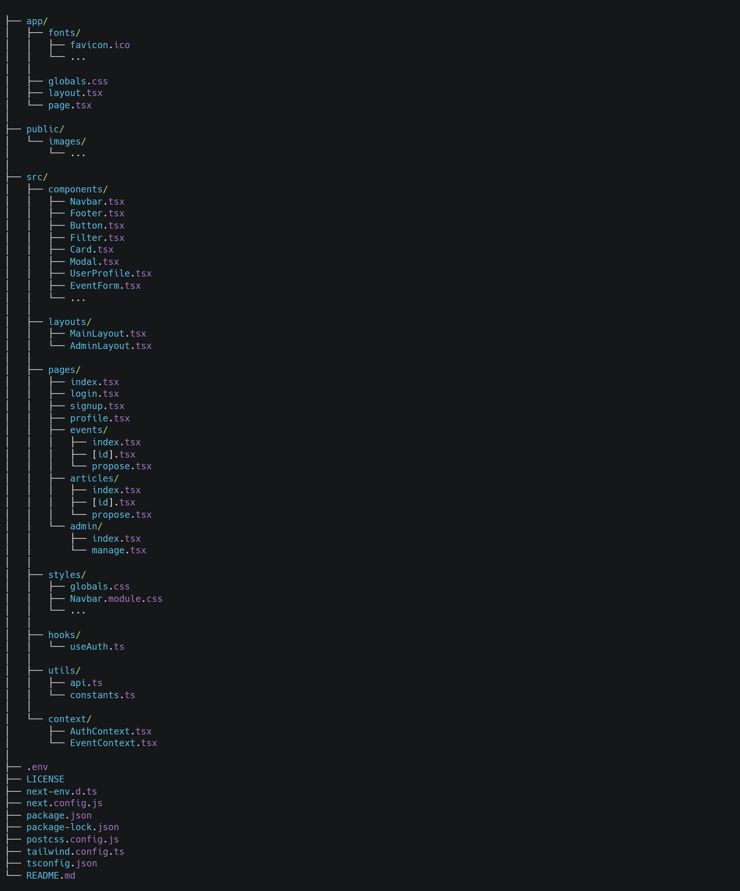

# 🌍 SicilyPulse

## Panoramica del Progetto

SicilyPulse è una piattaforma digitale innovativa che cattura il "battito" culturale della Sicilia, offrendo un'esperienza utente personalizzata e coinvolgente. Grazie all'integrazione di funzionalità avanzate e tecnologie moderne, SicilyPulse mira a diventare il punto di riferimento per contenuti interattivi, informazioni locali e coinvolgimento della community. Un'applicazione web sviluppata con **Next.js** che offre una panoramica completa degli eventi, delle attività, delle attrazioni culturali e delle esperienze gastronomiche presenti in Sicilia. L'applicazione integra anche un sistema di gestione utenti e un pannello di controllo per gli amministratori, che permette di monitorare e approvare contenuti generati dagli utenti tramite intelligenza artificiale.

## Caratteristiche Principali di SicilyPulse

### Home Page
La home page accoglie l'utente con una panoramica delle principali categorie disponibili:

- **Eventi**: Una selezione degli eventi principali in programma.
- **Attività**: Esperienze e attività da vivere in Sicilia.
- **Cultura**: Luoghi di interesse culturale.
- **Sapori**: Esperienze culinarie, ristoranti tipici e piatti tradizionali siciliani.

### Pagine Dettaglio
Ogni categoria (Eventi, Attività, Cultura, Sapori) ha una pagina dedicata con informazioni dettagliate e contenuti visivi.

### Ricerca
Una barra di ricerca permette agli utenti di trovare contenuti specifici all'interno delle varie categorie.

## Prenotazione Ticket

L'applicazione consente agli utenti di prenotare ticket per eventi e attività. Il sistema di prenotazione offre le seguenti funzionalità:

### 1. Selezione della Data e Orario
Gli utenti possono scegliere la data e l'orario preferito per partecipare all'evento direttamente dall'interfaccia dell'applicazione.

### 2. Numero di Biglietti
Possibilità di selezionare il numero di biglietti che si desidera acquistare.

### 3. Email di Conferma
Inserendo l'email, l'utente riceverà una conferma della prenotazione con tutti i dettagli relativi all'evento.

## Invio Email di Conferma

Dopo aver completato la prenotazione, il sistema invia automaticamente un'email di conferma all'indirizzo fornito. L'email include:

- **Data dell'Evento**: Data e ora selezionate per la partecipazione.
- **Numero di Biglietti**: Numero di biglietti prenotati.
- **Informazioni sull'Evento**: Dettagli aggiuntivi sull'evento e istruzioni su come completare il pagamento (se necessario).

### Profilo Utente
Gli utenti registrati possono accedere alla propria pagina profilo per gestire le proprie informazioni personali:

- **Visualizzazione delle informazioni personali**: Nome, cognome ed email.
- **Modifica dei dati personali**: Possibilità di aggiornare le informazioni del proprio profilo.
- **Eliminazione dell'account**: Gli utenti possono eliminare il proprio account in modo permanente.
- **Eventi Preferiti**: Visualizzazione degli eventi preferiti dall'utente.

### Pannello di Controllo Admin
Gli amministratori hanno accesso a un pannello di controllo dedicato, che consente di:

- **Gestione degli Articoli Generati dall'AI**: Gli utenti possono proporre articoli utilizzando un sistema basato su intelligenza artificiale. Gli articoli vengono inviati agli amministratori per la revisione.
- **Approvazione o Rifiuto degli Articoli**: Gli amministratori possono valutare gli articoli generati dagli utenti e decidere se approvarli o rifiutarli.
- **Pubblicazione degli Articoli**: Gli articoli approvati vengono automaticamente pubblicati e visualizzati nelle rispettive sezioni dell'applicazione.

### Proponi Evento
Gli utenti possono proporre nuovi eventi attraverso un modulo dedicato, specificando:

- **Categoria**: Selezione della categoria dell'evento (Concerto, Festival, Arte, Moda, ecc.).
- **Titolo e Luogo**: Inserimento del titolo e della location dell'evento.
- **Descrizione**: Descrizione dettagliata dell'evento.
- **Tag**: Assegnazione di tag per facilitare la categorizzazione.

## Gestione degli Accessi
L'applicazione prevede due livelli di accesso:

- **Utente Standard**: Può esplorare le sezioni dell'applicazione, aggiungere eventi preferiti, modificare il proprio profilo e proporre nuovi eventi.
- **Amministratore**: Ha accesso al pannello di controllo per la gestione dei contenuti, l'approvazione degli articoli generati dall'AI e la gestione degli utenti.

## Tecnologie Utilizzate

- **Next.js 13**: Framework React per applicazioni server-side rendering e static site generation.
- **React**: Libreria JavaScript per la costruzione di interfacce utente dinamiche.
- **Tailwind CSS**: Framework CSS per uno sviluppo rapido e modulare dello stile.
- **Firebase**: Utilizzato per l'autenticazione e la gestione del database.
- **OpenAI API**: Per la generazione automatica degli articoli proposti dagli utenti.
- **Librerie e Framework Moderni:** Utilizzo di librerie JavaScript avanzate per ottimizzare performance, animazioni e UX.
- **Vercel**: Piattaforma di hosting per applicazioni Next.js, utilizzata per il deploy dell'applicazione.

## Struttura del Progetto

## Installazione

1. **Clona il repository**:
   git clone https://github.com/simoneedge/final-project-cb10-team-d.git

2. **Naviga nella cartella del progetto:**:
   cd final-project-cb10-team-d

3. **Installa le dipendenze:**:
   npm install

4. **Avvia l'applicazione:**:
   npm run dev

   ## Collaboratori

### Redazione

**Adriana Piccione**  
[LinkedIn](https://www.linkedin.com/in/adriana-piccione-86288b114/) | [GitHub](https://github.com/Adriana1206)

**Luca Ferraresso**  
[LinkedIn](https://www.linkedin.com/in/luca-ferraresso/) | [GitHub](https://github.com/LucaFerraresso)

**Mariadomenica Scibilia**  
[LinkedIn](https://www.linkedin.com/in/mariadomenica-scibilia-a1361b2b3/) | [GitHub](https://github.com/Maryscib1997) | [Behance](https://www.behance.net/maryscibilia)

**Nunzio Basciano**  
[LinkedIn](https://www.linkedin.com/in/nunzio-basciano/) | [GitHub](https://github.com/NunzioBasciano)

**Stefania Beninati**  
[LinkedIn](https://www.linkedin.com/in/stefania-beninati-208577202/) | [GitHub](https://github.com/aniaBeninati)
